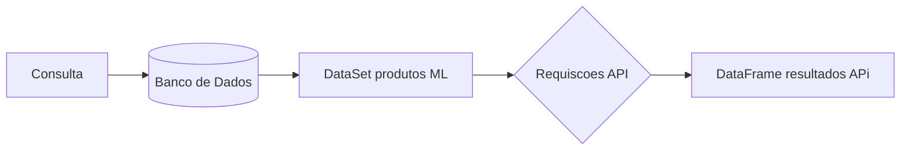
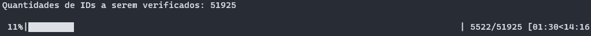

# If Compatibilities

## Índice 

* [Título e Imagem de capa](#Título-e-Imagem-de-capa)
* [Descrição do Projeto](#descrição-do-projeto)
* [Status do Projeto](#status-do-Projeto)
* [Funcionalidades e Demonstração da Aplicação](#funcionalidades-e-demonstração-da-aplicação)
* [Acesso ao Projeto](#acesso-ao-projeto)
* [Tecnologias utilizadas](#tecnologias-utilizadas)
* [Pessoas Desenvolvedoras do Projeto](#pessoas-desenvolvedoras)

## Descrição do projeto
O If Compatibilities (Se Compatibilidades), tem objetivo em verificar cada produto cadastrado na conta do Seller(Vendedor) MercadoLivre, se possui o campo de compatibilidades de veículos cadastrados.
Assim retornando um Excel com as informações.

## Fluxograma :thread:

## Exemplo:

## :hammer: Funcionalidades do projeto

- `Funcionalidade 1`: Consulta Banco de Dados PostgresSql.
- `Funcionalidade 2`: Conecta com a API do MercadoLivre.
- `Funcionalidade 2a`: Apresentação dos resultados.

## 📁 Acesso ao projeto
Você pode acessar os arquivos do projeto clicando [aqui](https://github.com/E-commerce-Pecista/if_compatibilities).

## ✔️ Técnicas e tecnologias utilizadas

- ``Python 3.11.3``
- ``Pandas 2.0.2``
- ``Requests 2.31.0``
- ``psycopg2 2.9.6``

## Autores

| [ Jeferson Lopes Reis](https://github.com/jef-loppes-reis) |
| :---: |
